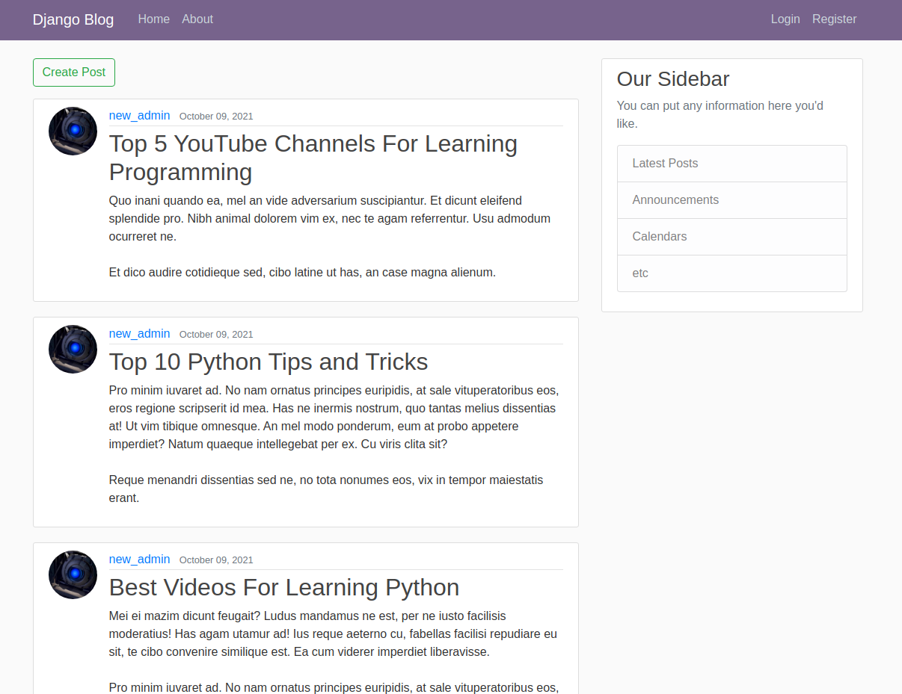

# Django Blog Application
This home project implemented like web blog application with Django and SQLite DB.
Here Users can to register and sign in. Clients also have profiles and could update their information and photos.
Moreover users could create, update and delete posts in this application.
There were implemented pagination, possibility to filter posts by users and reset password by email.

## Technologies
Project is created with:
* Python version: 3.9
* Django version: 3.2.6
* Bootstrap version: 4.3.1
* Docker version: 20.10.12

## Setup
To run this project, install it locally using:
1. docker pull hyperglitch/django_blog:latest
2. docker run -dp 8000:8000 hyperglitch/django_blog

## Here is the application on the Linux server
You can test my application on a Linux remote server
http://139.162.137.249:8000
